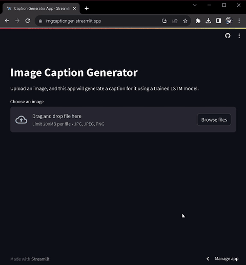

# Image Caption Generation using Deep Learning

[](https://github.com/Sajid030/image-caption-generator/blob/master/LICENSE.md)
[](https://www.python.org/)
[](https://www.tensorflow.org/)


[](https://www.streamlit.io/)

## Table of Contents

- [Demo](#demo)
- [Overview](#overview)
- [Dataset Details](#dataset-details)
- [Setup Instructions](#setup-instructions)
- [Streamlit Deployment](#streamlit-deployment)
- [Project Structure](#project-structure)
- [Issue Reporting](#issue-reporting)
- [Development Roadmap](#development-roadmap)

## Demo

- Access the app here: [Image Caption Generator](https://imgcaptiongen.streamlit.app/)

`Note:` If the above link is inactive, it may indicate a temporary shutdown or technical difficulties. We apologize for any inconvenience this may cause.

- If you appreciate the tool, please consider starring the repository.
- Here’s a glimpse of what the **Image Caption Generator** app looks like:



## Overview

This repository hosts the codebase for an advanced image captioning system utilizing deep learning. The core of this system uses the VGG16 model for robust feature extraction combined with a LSTM-based model to generate meaningful captions. The captioning system is trained on the Flickr8k dataset, enriched with an attention mechanism for enhanced caption precision.

**Important Note:** Although VGG16 is effective, its high memory demand may be problematic in constrained environments. Alternatively, MobileNetV2 offers a good balance between efficiency and accuracy, and is used in the deployed version of the app for its lower memory footprint.

Key components include:

- Feature extraction with VGG16 (MobileNetV2 recommended for efficiency)
- Caption preprocessing and tokenization
- An LSTM model with attention for dynamic captioning
- Comprehensive training and validation
- A Streamlit-based interface for real-time caption generation

## Dataset Details

The system uses the [Flickr8k dataset](https://www.kaggle.com/adityajn105/flickr8k), a well-curated collection of over 8,000 images each annotated with five distinct captions. This dataset is ideal for training due to its variety and rich annotations.

To start, download the dataset from [Kaggle](https://www.kaggle.com/adityajn105/flickr8k) and organize it as follows:

- flickr8k
  - Images
    - (image files)
  - captions.txt

## Setup Instructions

Ensure you have Python 3.10.12 installed, available via [Python's official website](https://www.python.org/downloads/). Upgrade older versions using pip, included with Python installations after Python 2.7.9 and Python 3.4.

To set up the project environment:

```plaintext
git clone https://github.com/Sajid030/image-caption-generator.git
cd image-caption-generator
pip install -r requirements.txt
```

## Streamlit Deployment

Steps for deploying on Streamlit Sharing:

1. Register for Streamlit Sharing and fork this repository.
2. Link your GitHub to Streamlit and select the forked repository.
3. In the Streamlit dashboard, configure as follows:
   ```
   [server]
   headless = true
   port = $PORT
   enableCORS = false
   ```
4. Deploy the app by clicking "Deploy app."

